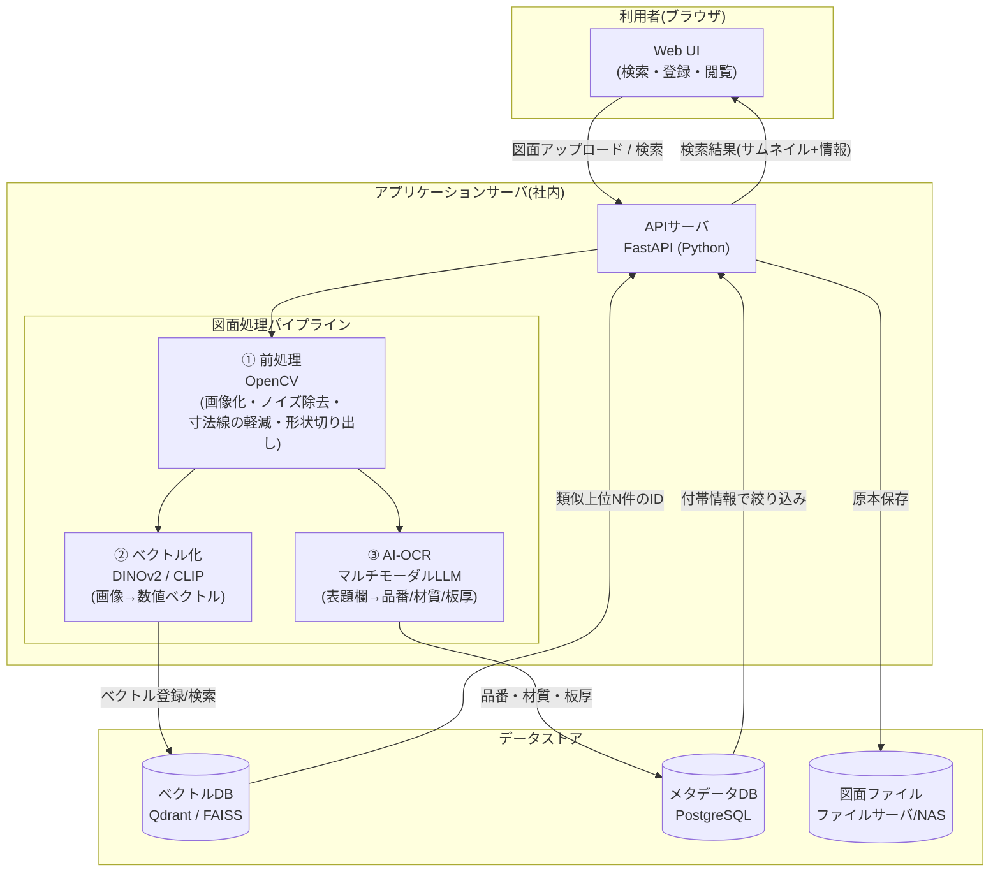

# AI類似図面検索システム 設計資料

**対象**: プレス加工業向け・自社構築(内製)
**版**: v1.0(ドラフト)

---

## 1. 目的と背景

- 見積・設計時に「過去の似た図面」を探す作業が属人化しており、ベテランの記憶に依存している
- 図面をアップロードすると、過去図面の中から形状が似ているものを瞬時に提示するシステムを自社構築する
- 併せて表題欄(品番・材質・板厚など)をAI-OCRで自動抽出し、条件絞り込みを可能にする

## 2. 要件

### 機能要件

| # | 機能 | 内容 |
|---|------|------|
| F1 | 図面登録 | PDF/TIFF/画像を一括登録。自動で前処理・ベクトル化・OCR |
| F2 | 類似検索 | 図面をアップロードすると類似順に過去図面を表示(上位20件程度) |
| F3 | 条件絞り込み | 材質・板厚・得意先・品番などの付帯情報でフィルタ |
| F4 | 図面閲覧 | 検索結果から元図面と付帯情報を即座に表示 |
| F5 | 関連情報の紐付け | 見積書・受注金額など既存データとの紐付け(将来拡張) |

### 非機能要件

| # | 項目 | 目標 |
|---|------|------|
| N1 | 検索速度 | 1秒以内(数万枚規模) |
| N2 | 精度 | Top-5正解率 80%以上(現場評価ベース) |
| N3 | セキュリティ | 図面は社外秘のため**オンプレ or 閉域環境**で運用。外部AI APIを使う場合は学習に使われない契約プランを利用 |
| N4 | 運用 | 図面追加は現場担当者がドラッグ&ドロップで完結 |

## 3. システム構成図

## 4. データフロー

### 4.1 登録フロー(バッチ/随時)

1. 図面ファイル(PDF/TIFF)をアップロード
2. **前処理**: 300dpi程度で画像化 → 二値化・傾き補正 → 表題欄領域と形状領域を分離
3. **ベクトル化**: 形状領域を埋め込みモデルに入力し、数値ベクトル(768次元程度)を生成 → ベクトルDBへ登録
4. **AI-OCR**: 表題欄画像をマルチモーダルLLMに渡し、品番・図番・材質・板厚・得意先をJSONで抽出 → メタデータDBへ登録
5. 原本ファイルとサムネイルをファイルサーバへ保存

### 4.2 検索フロー(リアルタイム)

1. 検索したい図面をアップロード(または既存図面を選択)
2. 登録時と同じ前処理・ベクトル化を実施
3. ベクトルDBで近傍検索 → 類似上位N件のIDを取得
4. メタデータDBの条件(材質・板厚など)で絞り込み
5. 類似度順にサムネイル+付帯情報を表示

## 5. 技術選定

| レイヤ | 採用候補 | 選定理由 |
|--------|----------|----------|
| 言語 | Python 3.11+ | AI・画像処理ライブラリが最も充実 |
| 前処理 | OpenCV | 線分検出・二値化・領域分離の定番。無料 |
| 埋め込みモデル | **DINOv2**(第一候補)/ CLIP | 自己教師あり学習モデルで図形の形状類似に強い。学習済みモデルを無料利用可、後からファインチューニング可能 |
| AI-OCR | Claude / GPT等のマルチモーダルAPI | 表題欄の手書き・多様なフォーマットに強い。閉域要件が厳しい場合はローカルVLMで代替 |
| ベクトルDB | **Qdrant**(第一候補)/ FAISS / pgvector | Qdrantは絞り込み(フィルタ付き検索)が得意で今回の用途に合う。すべてOSSで無料 |
| メタデータDB | PostgreSQL | 実績・拡張性。pgvector併用で構成を1DBに簡素化する選択肢もあり |
| API | FastAPI | Pythonで完結、開発が速い |
| UI | Streamlit(PoC)→ React(本番) | PoCは最速で画面を作れるStreamlit、本番で作り込み |
| サーバ | 社内サーバ(GPU任意) | 数万枚規模ならCPUのみでも実用。埋め込み生成を高速化したい場合のみGPU(RTX4060クラスで十分) |

## 6. 段階的開発計画

| フェーズ | 期間目安 | 内容 | ゴール |
|----------|----------|------|--------|
| **Phase 1: PoC** | 1〜1.5ヶ月 | 代表的な図面300〜500枚で最小構成(前処理+埋め込み+検索+簡易UI)を構築 | 現場の方が検索結果を見て「使えそうか」を判断できる状態 |
| **Phase 2: 精度改善** | 1〜2ヶ月 | 前処理チューニング(寸法線対策)、現場評価に基づく改善、AI-OCR追加、絞り込み検索 | Top-5正解率80%以上 |
| **Phase 3: 本番化** | 1〜2ヶ月 | 全図面の一括登録、本番UI、権限管理、バックアップ、運用手順書 | 全社利用開始 |
| Phase 4: 拡張(任意) | - | 見積金額との紐付け、類似図面ベースの見積支援、ファインチューニング | 見積工数の削減 |

## 7. 精度評価の方法

- 現場のベテランに「この図面に似ている過去図面」を10〜20問分選んでもらい、**正解セット**を作る
- システムの検索上位5件に正解が含まれる割合(**Top-5正解率**)を毎回計測
- 前処理やモデルを変更するたびに同じ問題で比較し、改善を数値で確認する

## 8. リスクと対策

| リスク | 対策 |
|--------|------|
| 古い図面のスキャン品質が悪い | 前処理の二値化・ノイズ除去パラメータを図面の年代別に調整。PoCで実データを必ず使う |
| 寸法線・注記が類似判断を邪魔する | 線種検出による軽減処理。効果不足ならセグメンテーションモデルで形状のみ抽出 |
| 「人が似ていると思う基準」とのズレ | 正解セットによる定量評価+現場ヒアリングを繰り返す。最終手段としてファインチューニング |
| 外部AI API利用時の機密性 | API入力を学習に使わないプラン(法人契約)を利用、または表題欄OCRのみローカルVLMに置換 |

## 9. 概算コスト(自社構築の場合)

- ソフトウェア: 基本すべてOSSのため **ライセンス費ゼロ**
- ハードウェア: 社内サーバ1台(GPUなし〜20万円程度のGPU追加)
- AI-OCR API利用料: 図面1枚あたり数円程度(数万枚の初期登録時のみまとまって発生)
- 主なコストは**開発工数**(PoCなら1人×1〜1.5ヶ月が目安)

---

*次のステップ: Phase 1 PoC用のPythonプロトタイプコード(前処理+埋め込み+検索の一式)*
